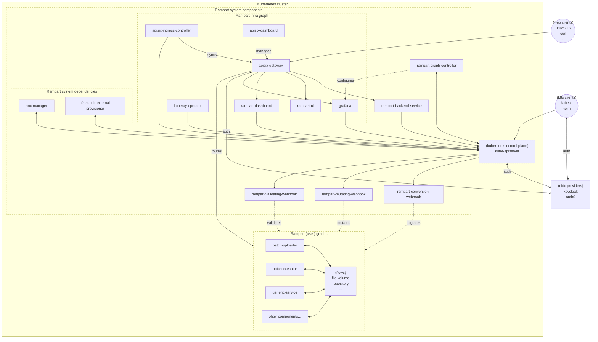
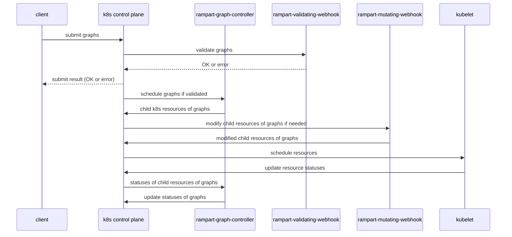

# Rampart Architecture

Rampart is a platform to create and manage ML infrastructure as graphs
(RampartGraph as a kubernetes custom resource) on kubernetes clusters.
This higher level graph abstraction enables (eventually) transparent
scalability across heterogeneous kubernetes clusters from multiple cloud
vendors and on-prem datacenters.

## Typical deployed rampart components

Note, the rampart system components are linked to their respective repositories.

## Typical rampart graph lifecyle sequences

Note, graph conversion sequence for graph backward compatibility is left out
for clearer illustration of the most common sequence.
